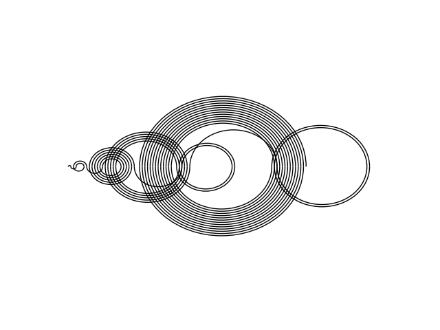
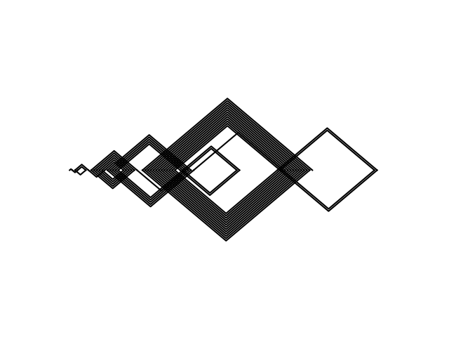
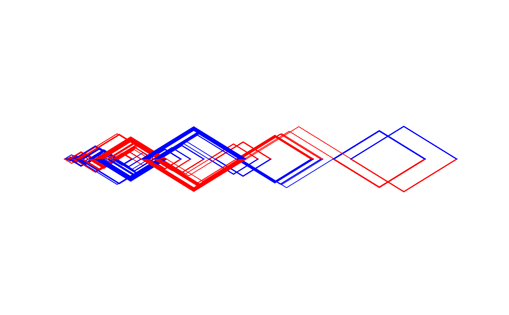

# Recaman Sequence fun

See the Recaman sequence in OEIS at http://oeis.org/A005132 

## Usage

```
./plot_recaman.py [-n <num> -s <shape> --min <min> --fc <forward_color> --bc <backward_color>]


Options:
-n --num      max number to follow pattern out (default 100)
-s --shape    shape of the plotted pattern (default dmnd) [options: dmnd (diamond), cir (circle), tri (triangle)]
--min         number to start polotting pattern at (default 0)
--fc          python color code for forward steps (default 'k')
--bc          python color code for backward steps (default 'k')
```


## Images




